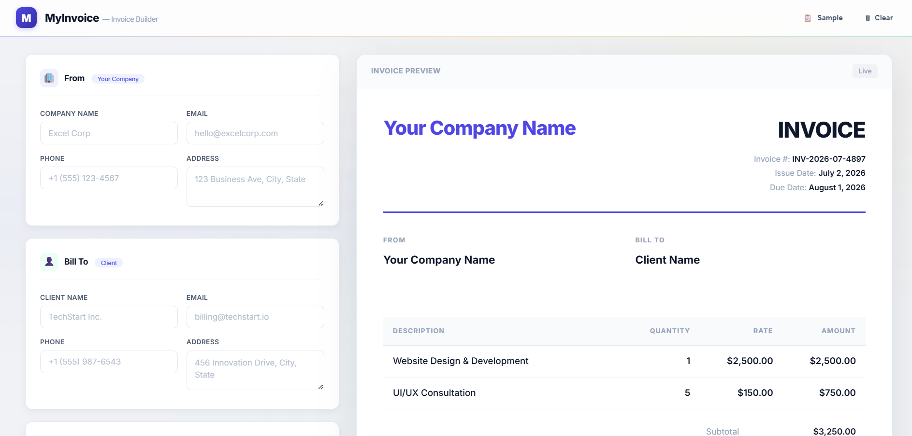
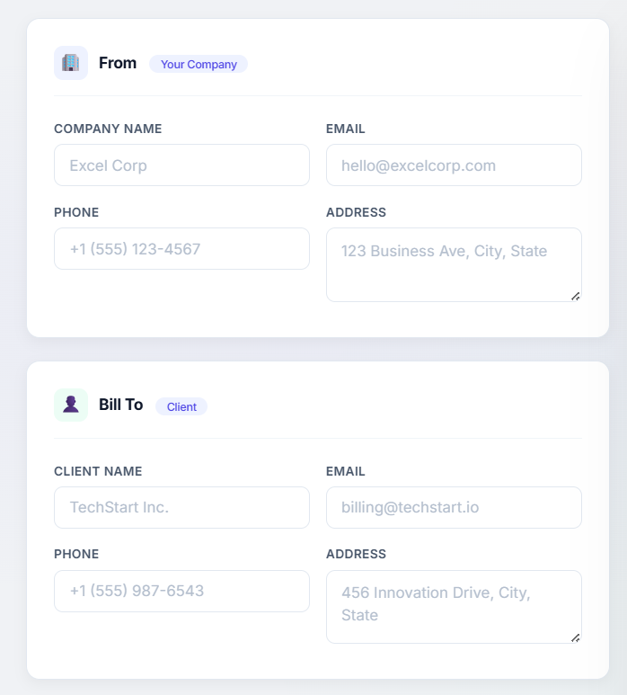
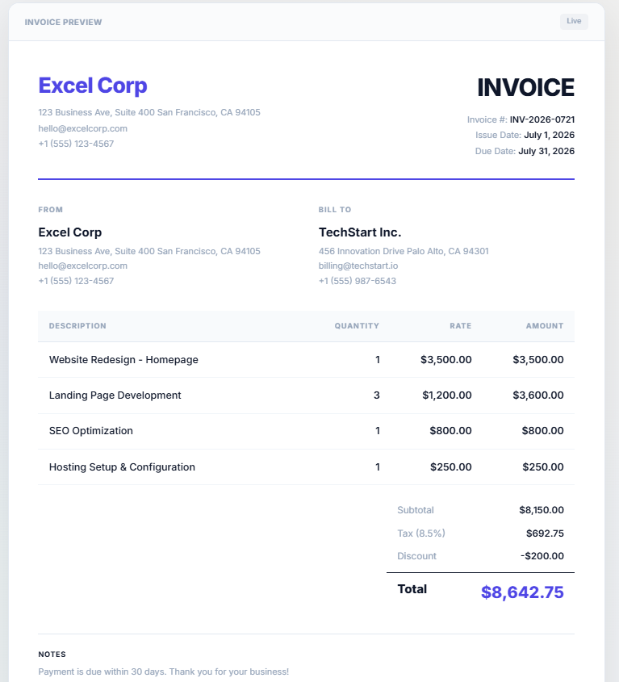

<div align="center">
  <br/>
  
  
  
  <br/><br/>

  <h1>📄 MyInvoice</h1>
  <h3>Create, preview, and export professional invoices — instantly.</h3>
  <p><i>A beautifully designed, no-dependency invoice generator that runs entirely in your browser.</i></p>

  <br/>

  <a href="#features"><strong>Features</strong></a>
  &nbsp;·&nbsp;
  <a href="#tech-stack"><strong>Stack</strong></a>
  &nbsp;·&nbsp;
  <a href="#project-structure"><strong>Structure</strong></a>

  <br/><br/>

  

  <br/><br/>
</div>

---

## ✨ Features

| | |
|---|---|
| 🎨 **Live Preview** | See your invoice update in real-time as you type |
| 📄 **PDF Export** | One-click download as a polished, print-ready PDF |
| 🏢 **Company Info** | Your name, address, email, phone — fully customizable |
| 👤 **Client Details** | Bill-to section with all recipient fields |
| 📦 **Line Items** | Add, remove, and edit items with auto-calculated amounts |
| 💰 **Tax & Discount** | Configurable tax rate (%) and discount ($) |
| 📝 **Notes & Terms** | Optional payment notes and terms & conditions |
| 📋 **Sample Data** | Pre-filled demo to see the app in action |
| 📱 **Responsive** | Works beautifully on desktop, tablet, and mobile |
| ☁️ **Zero Backend** | Everything runs client-side — no server, no database |

## 🖼️ Screenshots

<div align="center">
  <table>
    <tr>
      <td></td>
      <td></td>
    </tr>
    <tr align="center">
      <td><em>Side-by-side form layout</em></td>
      <td><em>Real-time invoice preview</em></td>
    </tr>
  </table>
</div>

## 🛠️ Tech Stack

```
📄 HTML5     — Semantic structure
🎨 CSS3      — Custom properties, grid, responsive design
⚡ Vanilla JS — No frameworks, zero dependencies
🖼️ html2canvas — DOM-to-canvas capture
📄 jsPDF     — PDF generation
🔤 Inter     — Clean, modern typeface
```

## 🧠 How It Works

1. **Fill out the form** — your company info, client details, invoice metadata, and line items.
2. **Watch the preview** — the right panel updates instantly with every keystroke.
3. **Export to PDF** — click the button and `html2canvas` captures the preview, then `jsPDF` wraps it into a downloadable file.

No data leaves your browser. No API calls. No sign-ups.

## 📁 Project Structure

```
├── index.html              # Main HTML — form + preview layout
├── css/
│   └── style.css           # All styling — design system, layout, responsiveness
├── js/
│   └── script.js           # App logic — CRUD items, calculations, PDF export
├── assets/
│   └── images/
│       ├── screenshot-main.png
│       ├── screenshot-form.png
│       └── screenshot-preview.png
└── README.md               # This file
```

## 🤝 Contributing

Found a bug or have an idea? Open an [issue](https://github.com/Olumidedara/invoice-generator/issues) or submit a PR — contributions are welcome!

## 📄 License

MIT — use it freely for personal or commercial projects.

---

<div align="center">
  <sub>Built with ❤️ by <a href="https://github.com/Olumidedara">Olumidedara</a></sub>
  <br/>
  <sub>Powered by vanilla JS, good coffee, and the desire to never open Word again.</sub>
</div>
